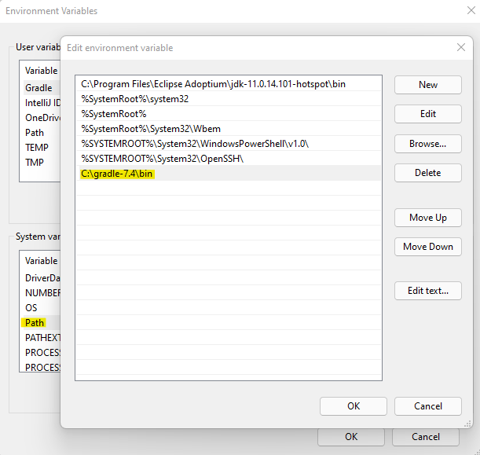

<p align="center"></p>


### Please make sure that you have already finished the prep installation part from <a href="../../Computer Setup Guide/installation tutorial.md">Here</a> in order to continue with Java part. if you do, then you can move to the next step.

## Needed Tools:
- you have to install the required tools. then, you'll do the configurations step by step. ( we will use Java Development Kit (JDK 11) in our course )


<h3 align="center"> install JDK 11 by clicking the icon below </h3>
<p align="center"> <kbd><a href="https://github.com/adoptium/temurin11-binaries/releases/download/jdk-11.0.14.1%2B1/OpenJDK11U-jdk_x64_windows_hotspot_11.0.14.1_1.msi"> </a></kbd>

 #### install JDK 11 from this link ONLY if your are a `Linux` Or `Mac OS` user <a href="https://www.oracle.com/java/technologies/javase/jdk11-archive-downloads.html">HERE</a>
- If you are a Mac user download the file >>>	macOS x64 DMG Installer `jdk-11.0.13_osx-x64_bin.dmg`
- If you are a Linux user download the file >>>	Linux x64 RPM Package `jdk-11.0.13_linux-x64_bin.rpm`
#### Note: you need to create oracle account in order to download the file. ( for mac and linux )

  <hr>
  
## IntelliJ IDEA
is an integrated development environment written in Java for developing computer software
<h3 align="center"> install IntelliJ by clicking the icon below </h3>

<p align="center"> <kbd><a href="https://download-cdn.jetbrains.com/idea/ideaIC-2021.3.2.exe"> </a></kbd>

- run the downloaded file `ideaIC-2021.3.2.exe` and don't forget to check the boxes like the image below:
  
<p align="center"><kbd> </kbd> </p>

Note: a restart is required to update the path variables for IntelliJ

<hr>

## Gradle
Gradle is a build automation tool for software development. It controls the development process in the tasks of compilation and packaging to testing, deployment.

<h2 align="center"> install Gradle by clicking the icon below </h2>
<p align="center"> <kbd><a href="https://services.gradle.org/distributions/gradle-7.4-bin.zip"> </a>

- after you download gradle then extract the file `gradle-7.4` to local disk `C` then navigate to this path `C:\gradle-7.4\bin` and COPY IT 
- right-click on the Computer icon ( This PC )  then click Properties -> Advanced System Settings -> Environmental Variables.
- Under `System Variables` double click `Path`, click on new and paste `C:\gradle-7.4\bin` then Click OK to save. ( check the image below )

<p align="center"><kbd> </kbd> </p>
  
#### NOTE: if you are a Mac user then run `brew install gradle` to install gradle
- if you are a linux user then refer to the linux part here <a href="https://gradle.org/install/#manually">Here</a>
  
## Configurations guide
### open `UBUNTU` and follow the commands line by line:
 
- first, let's update ubuntu packages using this command ( it will ask you for ubuntu password )
  
```
sudo apt-get update
```
- now, install Java on Ubuntu
  
```
sudo apt-get install default-jdk
```
  
<hr>

### Finally, let's make sure that everything is done as it should be:
- run the following commands
```
gradle -v
```
- you should get a result similar to this `Gradle 7.4` or higher
  
  
- let's check the Java version
```
java --version
```
- you should get a result like this `openjdk 11.0.14.1` or higher

<hr>
<h3 align="center"> THE END </h3>
<hr>

  <h3> <a href="Android Part.md" >Go To Android Part </a> </h3>
